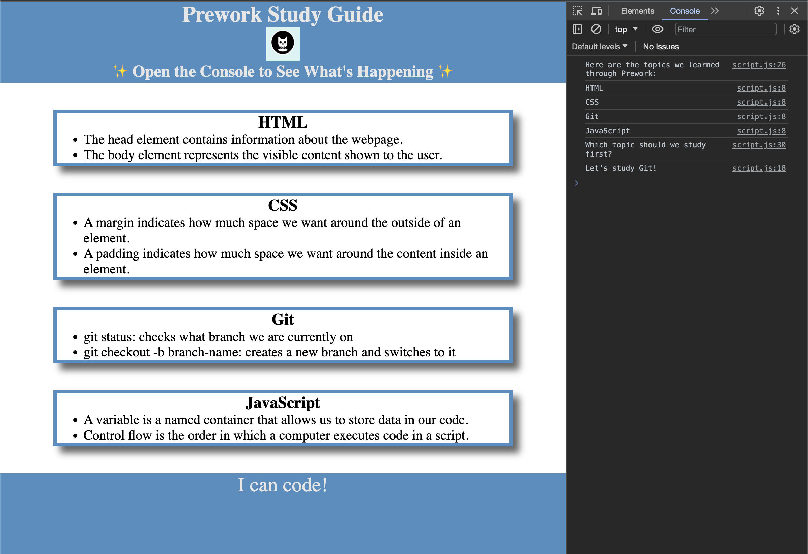

# Prework Study Guide

## Description

- This Prework Study Guide was created for boot camp students to gain an understanding of the relationship between HTML, CSS, and Javascript within a web page. It allows the user to capture study notes organized under four topic sections: HTML, CSS, Git, and Javascript.
- Although the page was relatively simple, its development also provided an opportunity to learn about version control using GitHub. Despite only employing basic branching, commits, pull requests, and merging, some errors allowed me some initial exploration into more complex topics such as reverts, merge conflicts, and pruning.

## Installation

N/A

## Usage

- Open file index.html in any browser to view the Prework Study Guide and its categorized study notes.
- Each section has notes about a certain topic. These topics are HTML, CSS, Git, and JavaScript.
- As indicated in the subheading, open the DevTools console by pressing Command+Option+I (macOS) or Control+Shift+I (Windows). A console panel should open either below or to the side of the webpage in the browser. There you will see JavaScript output, including a list of the study topics and a randomly selected study topic suggestion (see screenshot).

## Credits

N/A

## License

Please refer to the LICENSE in the repo.
